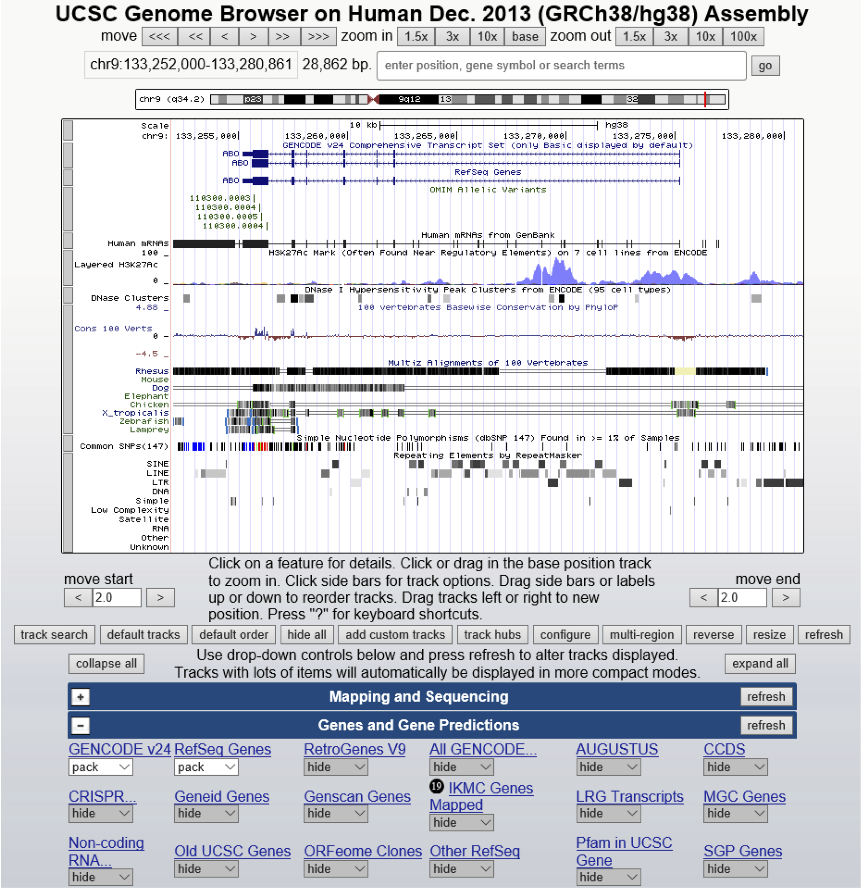
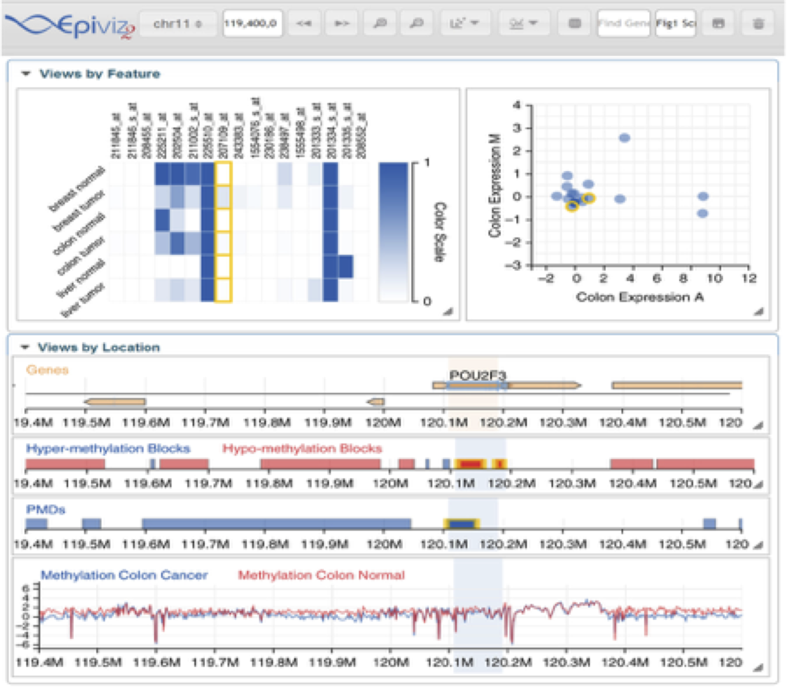
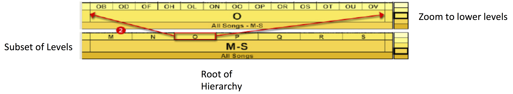
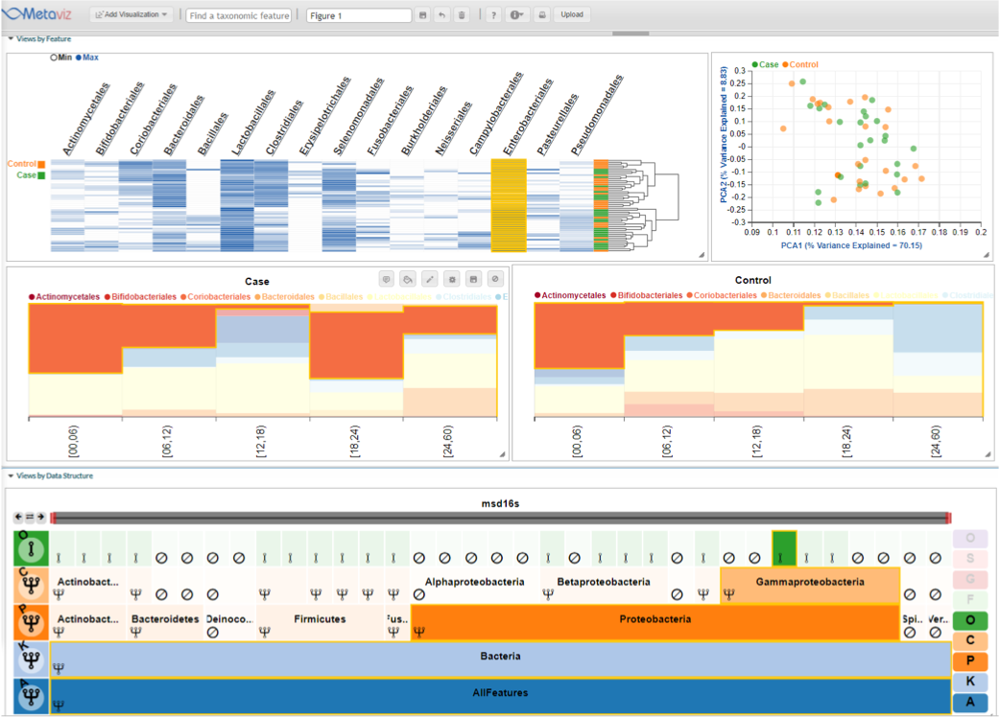
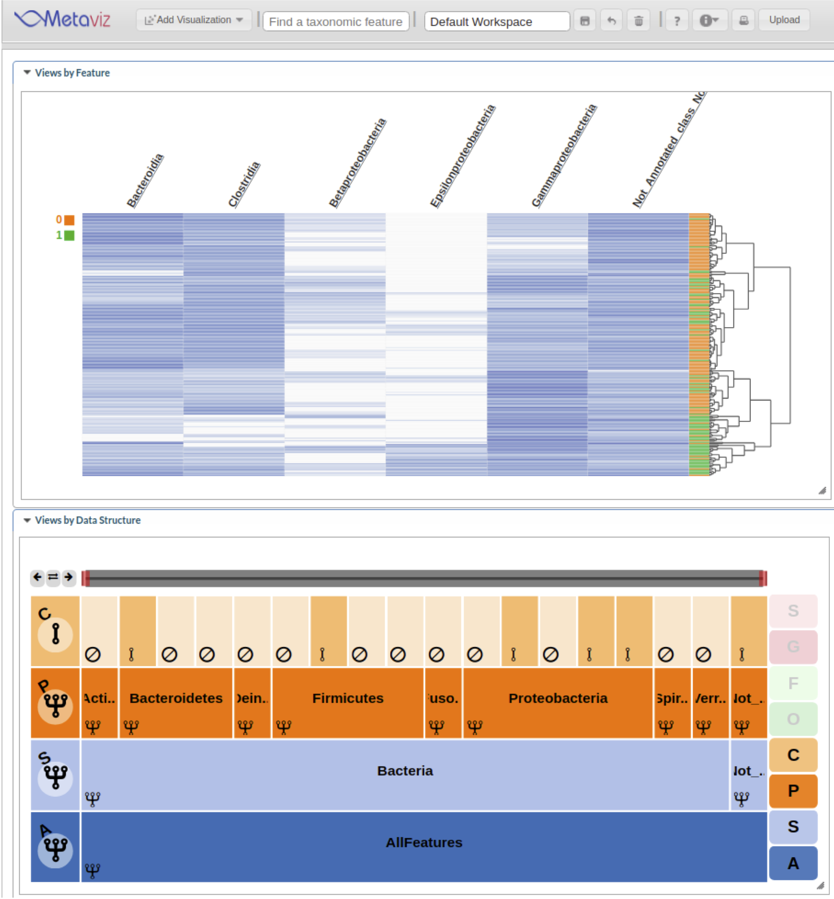
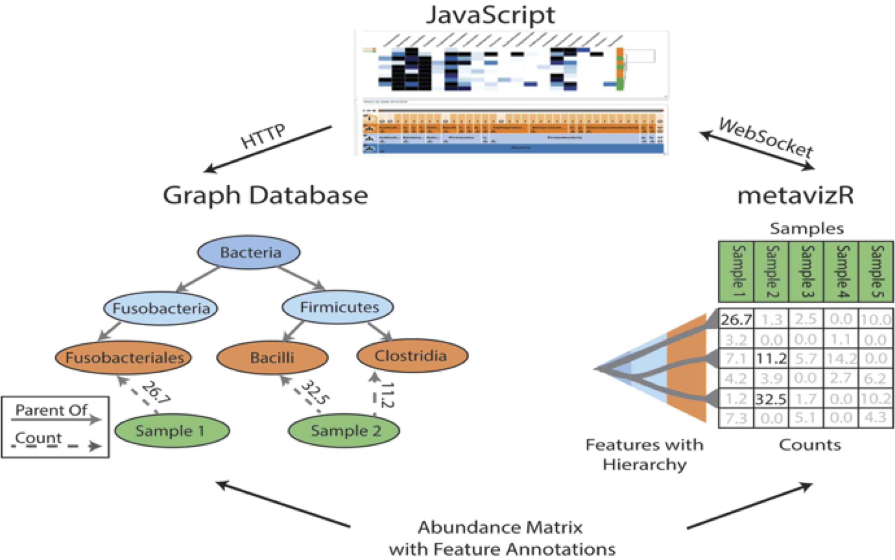
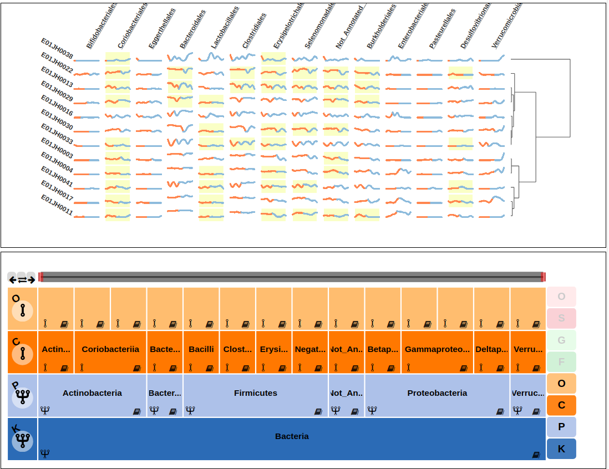
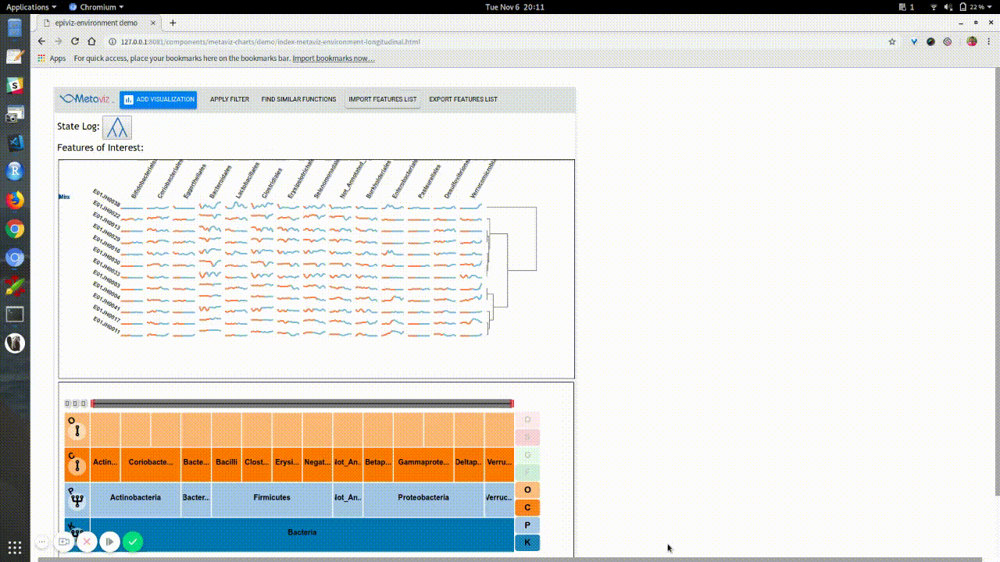

---
layout: false
class: inverse, center, middle

# Metaviz

.source[[Wagner et al., 2018 Nucleic Acids Research](https://academic.oup.com/nar/article/46/6/2777/4909991)]

---
class: split-50

## Genome Browsers

.column[

**Benefits**
- Perspective arises naturally to provide quick, intuitive navigation
- Genes and annotations integrated

**Track-based**

- Sequences and measurements are laid out across screen
]

.column[
.image-50[]
]

.source[https://genome.ucsc.edu]

---
class: split-50

## Epiviz: Interactive Visualization for Functional Genomics

.column[
### Separate track-based and non track-based visualization

Data visualizations updated based on user interaction

### Integrated with R/Bioconductor
]

.column[
.center.image-40[]
]

.source[[Chelaru et al. 2014, Nat. Methods]()]

---

## Microbiome data visualization challenges

### Features with a hierarchy
  - Need to view multiple levels of hierarchy made of thousands of nodes
  
### Need to support population surveys of many samples

### Support quantitative measurements with heatmaps, scatterplots, and boxplots

---

## Hierarchical navigation

Information Visualization technique for hierarchical data

Examine data at different levels and perform feature selection

### FacetZoom

.center[]

.source[Daschelt et al. 2008. CHI]

---
class: split-50

## Metaviz

.column[
Integrated, interactive taxonomic feature selection  
Statistically guided visual analysis  
Intuitive navigation for mechanism for hierarchical metagenomic data
]

.column[
.image-50[]
]

<!--demo: http://metaviz.cbcb.umd.edu/videos/msd16s.mp4-->

.source[Wagner et al., 2018. Nucleic Acids Research]
---

## Metaviz

.middle.center.image[]

---
class: split-50

## Integration with Bioconductor

.column[
Compute differential abundance with `metagenomeSeq`

Explore results through interactive visualization

]

.column[
.center.image-40[]
]

<!--demo: http://metaviz.cbcb.umd.edu/videos/metavizr.mp4-->
.source[http://bioconductor.org/packages/metavizr]

---

## Integration with Bioconductor

.middle.center.image-70[]

---
exclude: true

## Metaviz design considerations

Goal is to visualize multiple samples at once

Storing count data directly in web page will render slowly when viewing many samples

Client-server allows aggregations and other statistical operations to be computed at server

---

## Architecture

.center.middle[.image-80[]]
---

## Deployment options

University of Maryland Metagenome Browser (14k metagenomes)    
http://metaviz.cbcb.umd.edu

`metavizr`  
http://bioconductor.org/packages/metavizr.html

Local install  
https://github.com/epiviz/Metaviz  
https://github.com/epiviz/metaviz-data-provider

---
layout: true

## Metaviz for longitudinal designs

---
class:split-40

.column[
  How can we effectively display longitudinal data characteristics  
  E.g., heatmap is not effective
]

.column[
.center.middle[.image-60[]]
]

---
class:split-40

.column[
  How can we effectively display longitudinal data characteristics  
  
  Sparkline Matrix
]

.column[
.center.middle[.image-60[]]
]

---

<!--.center.middle.image-70[]-->
.center.middle.image-80[]

<!--demo: http://metaviz-dev.cbcb.umd.edu/metaviz2/demo/sparkline.html-->
