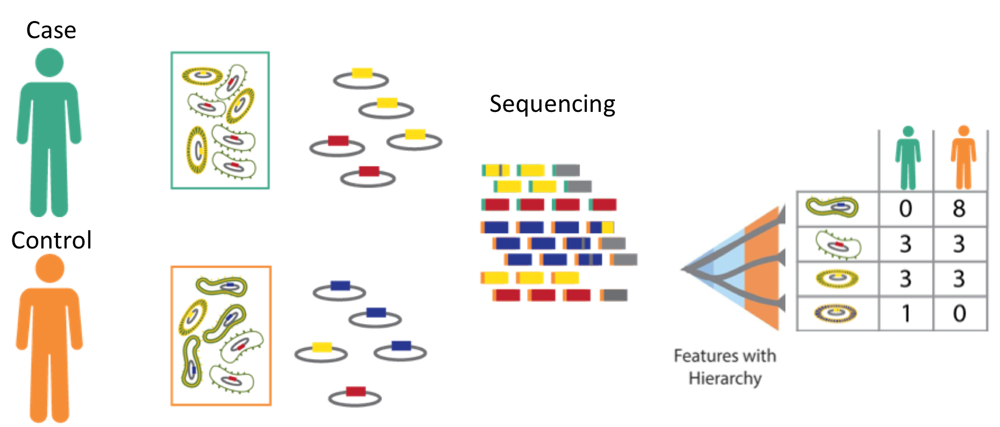
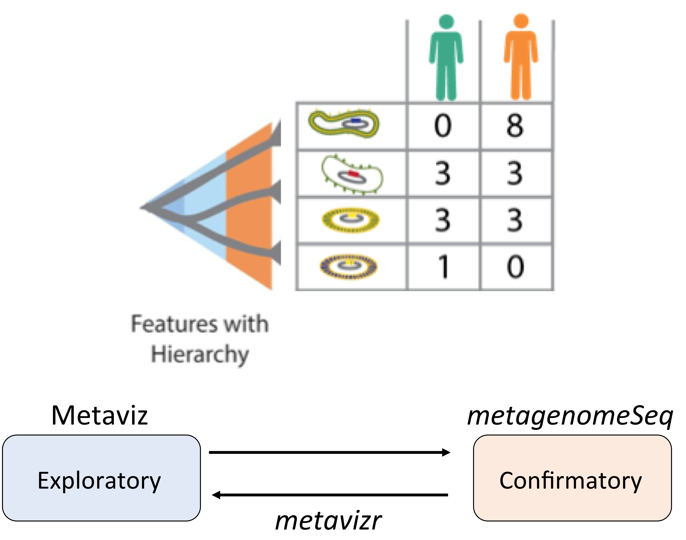

---
layout: true

## A longitudinal study

---
class: split-50

.column[
- 30 subjects (8 F, 22M) challenged with enterotoxigenic _E. coli_
- 16S profiling of stool samples one day before, day of and 9 days after
- Diarrehal symptoms recorded
- Ciproflaxin (antibiotic) given after symptoms (or 9 days if no symptoms)
]

.column[
.center.image-50[]
]

.source[[Pop et al., 2016 BMC Genomics](https://bmcgenomics.biomedcentral.com/articles/10.1186/s12864-016-2777-0)]

---

### Questions

.highlight[Is there an association between (pre-challenge) microbiome structure and response to challenge]

.highlight[Is there a time structure in the association between specific taxonomic units and presentation of symptoms]

---
layout: false

## Microbiome survey - data generation

.center.middle[]

---
layout: true

## This talk

---

### **Metaviz**  

http://metaviz.org  
Interactive visualization methods for metagenomic data  
Features for longitudinal data in development  

---

### **`metagenomeSeq`**

http://bioconductor.org/packages/metagenomeSeq  
Statistical methods for metagenomic data analysis  
Including longitudinal data

---

### **`metavizr`**

http://bioconductor.org/packages/metavizr  
Integration between R/Bioconductor infrastructure and interactive visualization

---

.center.middle[.image-60[]]
