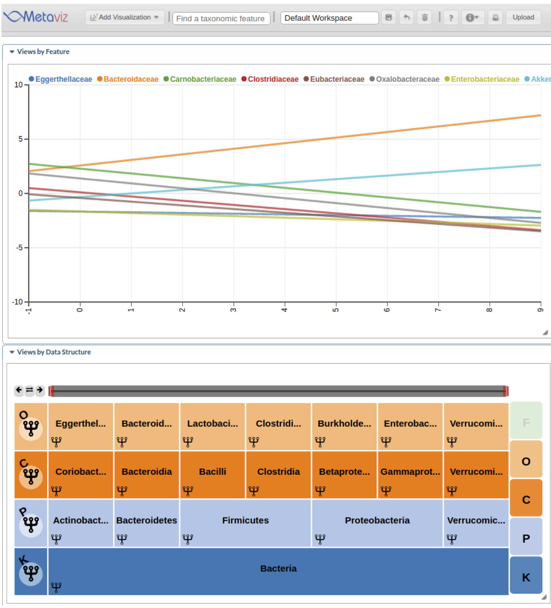

---
layout: false
class: inverse, center, middle

# `metagenomeSeq`

.source[[Paulson et al., 2017. _biorxiv_](https://www.biorxiv.org/content/early/2017/01/10/099457)]  
.source[[Paulson et al., 2013. _Nat. Methods_](https://www.nature.com/articles/nmeth.2658)]

---
layout: true

## Statistical modeling

---
class: split-40

.column[
  Detect intervals of differential abundance between two groups of interest.
  ]

.column[
  .center.image-60[]
  ]

---
  
  .center.middle.image-100[]

Fit using smoothing-spline ANOVA (`gss` package)

---
  
  

---
layout: false
class: inverse, center, middle

# `metavizr`

.source[http://bioconductor.org/packages/metavizr]

---
layout: true

# Interactivity with spline model

---
class: split-40

.column[
```{r, eval=FALSE}
library(metavizr)
library(etec16s)
data(etec16s)

app <- startMetaviz()
app$plot(etec16, type="TimeSeries", 
         formula=abundance~id+AntiGiven+
           time*AnyDayDiarrhea
)
```
]

.column[
.center.image-50[]
]


---
class: split-40

.column[
Inference depends on model parameter (smoothness of function)  
  
Use interactivity to explore sensitivity  
]

.column[
.center.image-50[]
]

---
class: split-40

.column[
Inference depends on model parameter (smoothness of function)  
  
Use interactivity to explore sensitivity  
]

.column[
.center.image-60[]
]

---
class: split-40

.column[
Inference depends on model parameter (smoothness of function)  
  
Use interactivity to explore sensitivity  
  
High smoothness penalty
]

.column[
.center.image-50[]
]

---
class: split-40

.column[
Inference depends on model parameter (smoothness of function)  
  
Use interactivity to explore sensitivity  
  
Low smoothness penalty
]

.column[
.center.image-50[]
]
